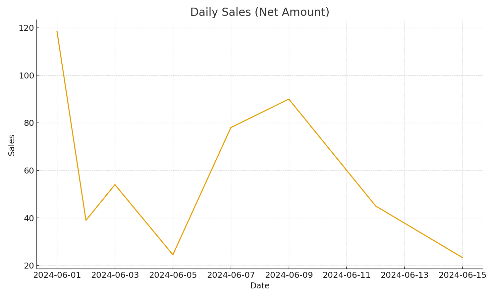

# Power BI Sales Dashboard




A polished starter kit to build and publish a **Power BI Sales Dashboard** quickly. It includes **sample CSV data**, **SQL schema & views (optional)**, **Power Query (M) scripts**, **DAX measures**, a clean **theme.json**, and **layout notes**.

---

## 🔗 Quick Links
- **Starter ZIP**: this repo structure is ready to upload as-is.
- **Theme**: `powerbi/theme.json`
- **DAX**: `powerbi/dax_measures.md`
- **M Scripts**: `powerbi/queries_m_scripts/*.pq.txt`
- **Screenshots (add yours)**: `docs/screenshots/`

---

## 🗂️ Repository Structure
```
power-bi-sales-dashboard/
├─ data/
│  ├─ sales.csv
│  ├─ products.csv
│  ├─ stores.csv
│  └─ employees.csv
├─ sql/
│  ├─ schema.sql
│  └─ views.sql
├─ powerbi/
│  ├─ queries_m_scripts/
│  │  ├─ Sales.pq.txt
│  │  ├─ Products.pq.txt
│  │  ├─ Stores.pq.txt
│  │  ├─ Employees.pq.txt
│  │  └─ Calendar.pq.txt
│  ├─ dax_measures.md
│  ├─ theme.json
│  └─ layout_notes.md
├─ docs/
│  └─ screenshots/
│     ├─ overview.png            # ← add your image(s)
│     ├─ store-performance.png
│     ├─ product-analysis.png
│     └─ sales-rep.png
└─ LICENSE
```

---

## 🚀 Build (CSV option – fastest)
1. Open **Power BI Desktop** → **Get Data → Text/CSV** → load all files from `data/`.
2. In **Model** view, ensure relationships:
   - `Sales[ProductID]` → `Products[ProductID]`
   - `Sales[StoreID]` → `Stores[StoreID]`
   - `Sales[EmployeeID]` → `Employees[EmployeeID]`
3. Create a **Calendar** table:
   - **Option A (Power Query)**: import `powerbi/queries_m_scripts/Calendar.pq.txt` in Power Query.
   - **Option B (DAX)**: `Calendar = CALENDAR(MIN(Sales[OrderDate]), MAX(Sales[OrderDate]))`
   - Mark `Calendar[Date]` as the **Date table** (Model view → Table tools).
4. Copy **DAX measures** from `powerbi/dax_measures.md` into a *Measures* table.
5. Apply the **Theme**: View → **Switch theme** → browse to `powerbi/theme.json`.
6. Build visuals following `powerbi/layout_notes.md`. Save as `.pbix`.

> ✅ This path is perfect for portfolio & interviews. For production/refresh, use the SQL option below.

---

## 🗄️ Build (SQL option – portable refresh)
1. Create a database (**SQL Server** or **Postgres**).  
2. Run `sql/schema.sql`, then load CSVs into tables (or use the M scripts to load CSVs into the DB).  
3. Run `sql/views.sql` to create standardized reporting views (`v_kpi_*`, `v_sales_enriched`).  
4. In Power BI Desktop: **Get Data** → connect to your DB → select the views.  
5. Reuse the **Calendar**, **DAX**, and **Theme** steps above.

> 🔁 This option makes scheduled refresh easier in the Power BI Service.

---

## 🖼️ Screenshots
Add PNGs to `docs/screenshots/` and link them here:

- **Overview**  
  `docs/screenshots/overview.png`

- **Store Performance**  
  `docs/screenshots/store-performance.png`

- **Product Analysis**  
  `docs/screenshots/product-analysis.png`

- **Sales Rep**  
  `docs/screenshots/sales-rep.png`

---

## ☁️ Publish & Refresh in Power BI Service

### Option A — CSV via OneDrive/SharePoint (no gateway)
Best when your `.pbix` reads CSV files stored in **OneDrive for Business** or **SharePoint**.

1. Move the `power-bi-sales-dashboard/` folder (or at least `data/`) into **OneDrive for Business** or a **SharePoint** document library under the **same work account** you use for Power BI.
2. In **Power BI Desktop**, **repoint** your data sources to that OneDrive/SharePoint path using the *OneDrive/SharePoint* connector (avoid using local `C:\` paths).
3. **Publish** the report (Home → Publish).
4. In the Power BI Service, go to **Dataset → Settings → Data source credentials** and sign in to OneDrive/SharePoint if prompted.
5. Choose **Scheduled refresh** (e.g., daily). OneDrive also auto-syncs file changes roughly hourly when connected via the same account.

**Gotchas**
- Privacy levels: set all CSV sources to **Organizational** in Desktop (File → Options → Data Load → Privacy).
- Folder moves/renames break paths—keep a stable folder structure.

### Option B — SQL Database via On‑Premises Data Gateway
Best when your `.pbix` reads **SQL Server/Postgres** (on-prem or VM).

1. Install the **On‑premises data gateway** (Standard mode) on a machine that can reach your database.
2. In the **Power BI Service**: Settings → **Manage gateways** → **Add data source**.
   - Pick the connector (SQL Server or PostgreSQL), enter server/db, auth, and test the connection.
3. Publish your report. In the Dataset settings:
   - Under **Gateway connection**, toggle **Use a data gateway** and map each data source.
   - Under **Data source credentials**, confirm valid creds.
   - Set **Scheduled refresh** (times + frequency).
4. For DirectQuery (optional), use DirectQuery in Desktop and ensure the gateway allows it.

**Gotchas**
- Firewalls/ports must allow the gateway to reach DB.
- If schema changes (columns/types), you’ll need to republish.

---

## 🔒 Row‑Level Security (optional)
- Create roles (Modeling → Manage roles) and filter by dimension columns, e.g. `Stores[Region] = "East"`.
- Or build a `SecurityUsers` table: columns **Email**, **Region**; relate to `Stores`; define role filter `SecurityUsers[Email] = USERPRINCIPALNAME()`.

---

## 🧪 Validation Checklist
- Totals match CSV sums (Sales, Units, Orders, Margin).
- Date table marked & related to `Sales[OrderDate]` (single direction).
- No relationship ambiguity (avoid bi-directional unless intentional).
- No `#Error` values in Power Query.

---

## 🙌 Credits & License
- Starter created for data engineering/analytics portfolios.  
- License: **MIT** (see `LICENSE`).

---

**Questions or improvements?** Open an issue or PR. Happy building! 🎉